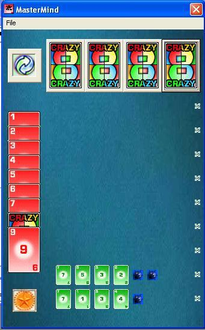

<div align="center">

## A beautiful Master Mind Card Game with open/save game\.\(UPDATRED\)


</div>

### Description

A beautiful Master Mind Card Game with open/save game and beautiful graphic and sound trakes.

in this game you should find the right order of cards included in the game. (Beautiful and Enjoyable!!!)

Please visit my site for more codes: www.geocities.com/m_alian14
 
### More Info
 


<span>             |<span>
---                |---
**Submitted On**   |2004-03-05 15:09:40
**By**             |[The MOLiSoft team](https://github.com/Planet-Source-Code/PSCIndex/blob/master/ByAuthor/the-molisoft-team.md)
**Level**          |Advanced
**User Rating**    |5.0 (15 globes from 3 users)
**Compatibility**  |VB 5\.0, VB 6\.0
**Category**       |[Games](https://github.com/Planet-Source-Code/PSCIndex/blob/master/ByCategory/games__1-38.md)
**World**          |[Visual Basic](https://github.com/Planet-Source-Code/PSCIndex/blob/master/ByWorld/visual-basic.md)
**Archive File**   |[A\_beautifu171685362004\.zip](https://github.com/Planet-Source-Code/the-molisoft-team-a-beautiful-master-mind-card-game-with-open-save-game-updatred__1-52178/archive/master.zip)

### API Declarations

```
SetWindowRgn
CreateRoundRectRgn
RegEnumValue
RegCloseKey
RegOpenKey
ShellExecute
sndPlaySound
RegCreateKeyEx
RegSetValueEx
```


